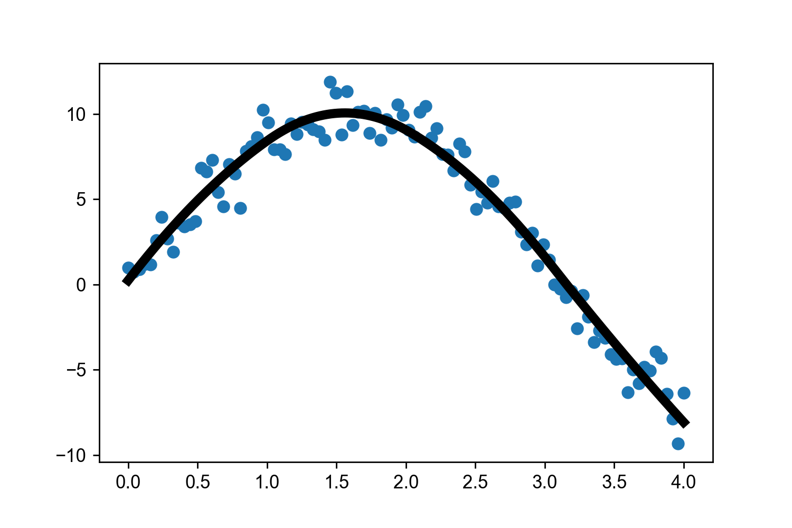

.. skspline documentation master file, created by
   sphinx-quickstart on Tue Apr 10 21:23:15 2018.
   You can adapt this file completely to your liking, but it should at least
   contain the root `toctree` directive.

Scikit Spline
=============

A Scikit-learn interface on Scipy's ``Univariate Spline``.

.. code-block:: python

  import matplotlib.pyplot as plt
  import numpy as np
  import skspline

  # Simulate data.
  x = np.linspace(0, 4, 100)
  y = 10*np.sin(x)
  yerr = np.random.randn(len(y_))

  # Add noise to y.
  y = y + yerr

  # Initialize a Scikit Spline model and fit.
  m = skspline.Spline(k=2)
  m.fit(x, y)

  # Get model
  xmodel = np.linspace(0, 4, 1000)
  ymodel = m.predict(xmodel)

  # plot data and model
  plt.scatter(x, y)
  plt.plot(xx,yy, color='k', linewidth=5)

.. toctree::
   :maxdepth: 2
   :caption: Contents:

Indices and tables
==================

* :ref:`genindex`
* :ref:`modindex`
* :ref:`search`
